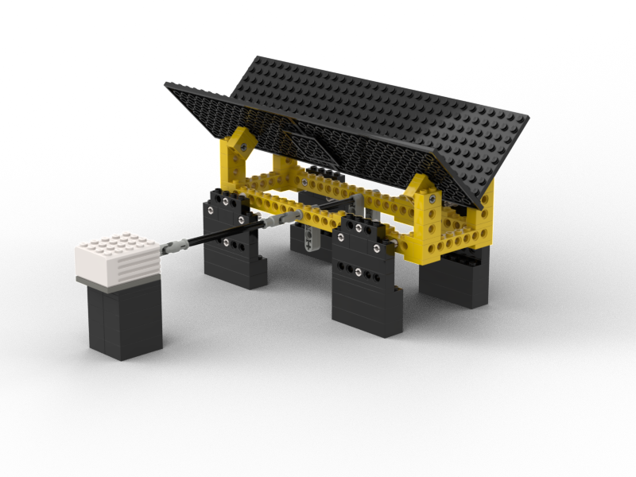

# Hardware

This page starts to document the hardware of the LEGO sorting machine. For information on the general stages of LEGO sorting machines please see [this blog post](https://medium.com/@bricksortingmachine/lego-sorting-machine-overview-d390645759f9).

## LEGO

#### V-Channel Vibration Feeder
- [Instructions](vchannel/vchannel.pdf)
- [Bricklink Studio File](vchannel/vchannel.io)

 

## Non-Lego
